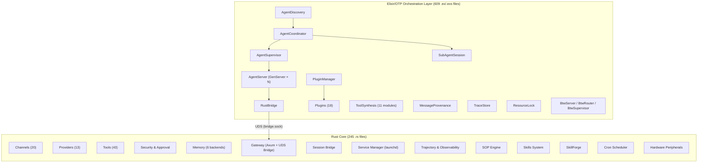

<p align="center">
  
</p>

<h1 align="center">RustyClaw</h1>

<p align="center">
  <strong>Multi-agent AI runtime — Rust core, Elixir/OTP orchestration</strong>
</p>

<p align="center">
  <a href="https://github.com/tezra-io/rustyclaw/actions/workflows/ci.yml"></a>
  <a href="LICENSE-APACHE"></a>
  
  
  <a href="https://github.com/tezra-io/rustyclaw/stargazers"></a>
</p>

---

## What is RustyClaw?

RustyClaw is a multi-agent AI runtime that pairs a high-performance **Rust core** (245 source files, 289 total `.rs` across the repo) with an **Elixir/OTP orchestration layer** (609 `.ex`/`.exs` files) for multi-agent coordination. The Rust layer handles LLM providers, messaging channels, tool execution, security, and memory. The Elixir layer manages agent lifecycle, supervision, inter-agent messaging, plugin orchestration, and dynamic tool synthesis using OTP primitives.

Key numbers:

- **20 messaging channels** — Telegram, Discord, Signal, Slack, WhatsApp, iMessage, and more
- **13 LLM providers** — Anthropic, OpenAI, Gemini, Ollama, Bedrock, OpenRouter, and more
- **43 built-in tools** — shell, file I/O, web, memory, browser, cron, SOPs, skills, hardware
- **18 Elixir plugins** — agent orchestration, CI/CD, quality gates, batch processing
- **11 tool synthesis modules** — dynamic tool generation, sandboxing, static analysis
- **6 memory backends** — SQLite, Markdown, Qdrant, Postgres, Lucid, Vector
- **175 design & reference docs** across 13 documentation categories

## Architecture

RustyClaw is a two-layer system connected by a Unix Domain Socket (UDS) bridge:



<details>
<summary>ASCII fallback (for terminals)</summary>

```
┌──────────────────────────────────────────────────────────────┐
│          Elixir/OTP Orchestration Layer (609 files)           │
│                                                              │
│  AgentDiscovery ── AgentCoordinator ── AgentSupervisor       │
│                         │                                    │
│                  AgentServer (GenServer × N)                  │
│                         │                                    │
│  PluginManager ── 18 Plugins     SubAgentSession (ETS)       │
│  ToolSynthesis (11 modules)      MessageProvenance           │
│  BtwServer/BtwRouter/BtwSupervisor   TraceStore              │
│  ResourceLock    AgentDefinition     RustBridge              │
└─────────────────────────┬────────────────────────────────────┘
                          │ UDS (bridge.sock)
┌─────────────────────────▼────────────────────────────────────┐
│                       Rust Core                              │
│                                                              │
│  Channels (20)   Providers (13)   Tools (43)   Memory (6)    │
│  Security/Approval   Gateway (Axum)   Session Bridge         │
│  Service Manager     Trajectory       SOP Engine             │
│  Skills System       SkillForge       Cron Scheduler         │
│  Hardware Peripherals   Observability (Prometheus, OTel)     │
└──────────────────────────────────────────────────────────────┘
```

</details>

### Layer responsibilities

**Elixir/OTP layer owns:**
- Agent lifecycle — spawn, stop, restart via OTP supervision trees
- Agent registry and discovery — capability-based routing, delegation ACL
- Inter-agent messaging — BEAM message passing, message provenance tracking
- Plugin system — 18 plugins for orchestration, integrations, and workflow
- Tool synthesis — dynamic tool generation with sandboxing and static analysis
- Session management — ETS-backed session lifecycle (pending/active/completed/failed)
- Resource coordination — distributed locking, trace storage

**Rust core owns:**
- Messaging channels — 20 platform integrations
- LLM provider abstraction — 13 providers with streaming and tool calling
- Tool execution — 43 tools including shell, file, web, browser, hardware
- Security — policy engine, sandboxing (Bubblewrap, Firejail, Landlock, Docker), prompt guard, secrets
- Memory — 6 backends with vector search, chunking, and embeddings
- HTTP gateway — Axum server with webhooks, SSE, WebSocket
- Session bridge — binding table, slash commands, Claude Code process manager
- Service management — launchd integration, daemon mode
- Trajectory tracking — conversation logging, ShareGPT export
- SOP engine — standard operating procedures with gates and approvals
- Skills system — install, audit, create, edit, delete
- Cron — task scheduling (cron expressions, one-shot, interval)
- Hardware — STM32, RPi GPIO, Arduino peripheral control

### Communication: UDS bridge

The Rust and Elixir layers communicate via **Unix Domain Sockets** (`bridge.sock` / `elixir.sock`), replacing the earlier HTTP localhost bridge. This provides lower latency and tighter coupling without network overhead. The bridge supports JSON framing with a 1 MB body limit and 300s timeout to accommodate long-running LLM calls.

## Features

### Messaging Channels (20)

| Channel | Notes |
|---------|-------|
| Telegram | Full bot API |
| Discord | Gateway + interactions |
| Signal | Via signal-cli REST API |
| Slack | Bot + Events API |
| WhatsApp | Direct web client |
| WhatsApp (WATI) | WhatsApp Business API |
| iMessage | macOS-native via Linq |
| Linq | iMessage, RCS, SMS via Partner V3 API |
| Matrix | E2EE supported |
| IRC | Standard IRC protocol |
| Nostr | Decentralized messaging |
| MQTT | IoT-style pub/sub |
| DingTalk | Enterprise messaging |
| Lark | Bytedance workspace |
| QQ | Tencent messaging |
| Mattermost | Self-hosted chat |
| Nextcloud Talk | Nextcloud integration |
| Email | IMAP/SMTP |
| ClawdTalk | Voice calls via Telnyx SIP |
| CLI | Terminal interactive mode |

### LLM Providers (13)

Anthropic, OpenAI, Google Gemini, Ollama, AWS Bedrock, OpenRouter, GLM (Zhipu), Telnyx, OpenAI-compatible, Copilot, Router (multi-provider), Reliable (fallback chain), Codex.

### Tools (43)

Shell execution, file read/write/edit, glob search, content search, web fetch, web search, HTTP requests, browser automation, screenshots, PDF reading, image info, memory store/recall/forget, Git operations, cron management (add/list/remove/run/update/runs), SOP execution (execute/list/status/advance/approve), skill management (create/edit/delete/patch), delegate, schedule, proxy config, hardware board info, hardware memory read/map, Composio integration, Pushover notifications, CLI discovery, synth proxy, and 4 Elixir-side agent tools (spawn/list/kill/message).

### Elixir Plugin System (18 plugins)

| Plugin | Purpose |
|--------|---------|
| ClaudeCodePlugin | Claude Code agent integration |
| CodexPlugin | OpenAI Codex agent integration |
| ContextBuilder | Dynamic context assembly for agents |
| LinearIntegration | Linear issue tracker sync |
| GitWorktree | Git worktree management for concurrent work |
| CronBridge | Cron scheduling from Elixir side |
| BatchProcessor | Bulk operation handling |
| ProgressTracker | Task progress monitoring |
| TaskQueue | Priority-based task queuing |
| QualityGate | Automated quality checks |
| AutoRouter | Intelligent task routing |
| PluginRouter | Plugin dispatch and discovery |
| Worker | Background task execution |
| RetryScheduler | Retry logic with backoff |
| TaskOrchestrator | Multi-step task coordination |
| BaseLLMPlugin | Base class for LLM-backed plugins |
| Manager | Plugin lifecycle management |
| Behaviour | Plugin behaviour/interface definition |

### Tool Synthesis (11 modules)

The Elixir layer can dynamically generate new tools at runtime:

- **Synthesizer** — generates tool implementations from natural language descriptions
- **Composer** — combines multiple tools into composite workflows
- **Registry** — tracks synthesized tools and their metadata
- **Persistence** — durable storage for synthesized tools
- **Sandbox** — isolated execution environment for untrusted tools
- **Isolation** — process-level isolation for tool execution
- **StaticAnalyzer** — code analysis before tool deployment
- **Probation** — graduated trust system for new tools
- **Improver** — iterative tool refinement based on usage
- **ApiRouter** — HTTP routing for synthesized tool endpoints
- **SynthesizedTool** — runtime representation of a generated tool

### Session Bridge

The session bridge connects messaging channels to AI coding agents:

- **Binding table** — maps channel conversations to agent sessions
- **Process manager** — lifecycle management for Claude Code processes
- **Slash commands** — `/bridge`, `/unbind`, and other session control commands

### Security

- **Deny-by-default policy engine** — `SecurityPolicy` with path validation and `allowed_roots`
- **OS-level sandboxing** — Bubblewrap, Firejail, Landlock, Docker
- **Prompt guard** — content scanning and leak detection
- **Secret management** — encrypted credential storage
- **Human-in-the-loop approval** — governance system for sensitive operations
- **OTP-based authentication** — time-based one-time passwords
- **Pairing** — device pairing for gateway access
- **E-stop** — emergency kill-all for runaway agents

### Observability & Trajectory

- **Prometheus metrics** — built-in metrics exporter
- **OpenTelemetry** — distributed tracing support
- **Trajectory tracking** — full conversation logging with rotation
- **ShareGPT export** — trajectory export in ShareGPT format
- **Runtime trace** — execution tracing
- **Elixir TraceStore** — centralized trace storage on the orchestration side
- **MessageProvenance** — tracks message origin and routing through the agent mesh

### Memory Backends (6)

| Backend | Type |
|---------|------|
| SQLite | Embedded relational |
| Markdown | File-based |
| Qdrant | Vector search |
| Postgres | Relational |
| Lucid | Semantic memory |
| Vector | Embedding-based retrieval |

Plus: chunking, embeddings, response caching, snapshot/restore, and memory hygiene (cleanup/compaction).

### Skills System

```bash
rustyclaw skills install <name>    # Install a skill from registry
rustyclaw skills list              # List installed skills
rustyclaw skills audit <path>      # Security audit a skill directory
rustyclaw skills remove <name>     # Remove an installed skill
```

Skills are user-defined capability packages with manifest files (`SKILL.md` or `SKILL.toml`). The audit system checks for symlink attacks, suspicious scripts, and manifest integrity.

### SkillForge

Automated skill development toolkit:
- **Scout** — discovers potential skill candidates
- **Evaluate** — assesses skill quality and coverage
- **Integrate** — merges skills into the runtime
- **Mod** — the main SkillForge module

### SOP Engine

Standard Operating Procedures with structured execution:

```bash
rustyclaw sop list                 # List available SOPs
rustyclaw sop execute <name>       # Start an SOP
rustyclaw sop status <id>          # Check SOP progress
rustyclaw sop advance <id>         # Move to next step
rustyclaw sop approve <id>         # Approve a gate
```

SOPs support conditions, gates, metrics, audit logging, and multi-step dispatch.

### Service Management

RustyClaw runs as a background service via launchd (macOS) with automatic restart:

```bash
rustyclaw service install          # Install as login item
rustyclaw service start            # Start the daemon
rustyclaw service stop             # Stop the daemon
rustyclaw service restart          # Restart
rustyclaw service status           # Check status
rustyclaw service uninstall        # Remove from login items
```

The `daemon` command starts both the Rust core (gateway, channels, heartbeat, scheduler) and the Elixir/OTP orchestration layer as supervised child processes. Environment variables (API keys, etc.) are forwarded to the launchd plist automatically.

## Quick Start

### Prerequisites

- **Rust 1.91+** — `rustup update stable`
- **Elixir 1.17+** — required for the orchestration layer (optional: runs in degraded mode without it)
- At least one LLM provider API key (or Claude Code installed for OAuth auto-discovery)

### Install from source

```bash
git clone https://github.com/tezra-io/rustyclaw.git
cd rustyclaw
cargo install --path .

# Elixir orchestration layer
cd elixir/rustyclaw_orchestrator
mix deps.get
mix compile
```

### First run

```bash
# Quick setup — provider + API key + model
rustyclaw onboard

# Full interactive wizard — provider, channels, security, memory, etc.
rustyclaw onboard --interactive
```

### Running

```bash
# Interactive agent in your terminal
rustyclaw agent

# Single-shot message
rustyclaw agent -m "Summarize today's logs"

# HTTP/WebSocket gateway only
rustyclaw gateway

# Full autonomous runtime — gateway + channels + scheduler + Elixir orchestrator
rustyclaw daemon

# Start without Elixir orchestrator (degraded single-agent mode)
rustyclaw daemon --no-elixir
```

### Managing channels

```bash
rustyclaw channel add              # Add a channel interactively
rustyclaw channel list             # List configured channels
rustyclaw channel doctor           # Diagnose channel issues
rustyclaw onboard --channels-only  # Reconfigure channels only
```

### Configuration

RustyClaw reads configuration from `~/.rustyclaw/config.toml`:

```toml
default_provider = "anthropic"
default_model = "claude-sonnet-4-6"
default_temperature = 0.7

[channels_config.telegram]
bot_token = "your-bot-token"
allowed_users = ["your_username"]

[channels_config.signal]
http_url = "http://127.0.0.1:8686"
account = "+1234567890"

[memory]
backend = "sqlite"

[gateway]
require_pairing = true

[security]
# allowed_roots = ["/home/user/projects"]
# sandbox = "bubblewrap"
```

See [docs/config-reference.md](docs/config-reference.md) for the full schema.

## CLI Reference

| Command | Description |
|---------|-------------|
| `rustyclaw onboard` | Quick setup (provider + key) |
| `rustyclaw onboard --interactive` | Full wizard (channels, security, memory, etc.) |
| `rustyclaw agent` | Interactive agent chat |
| `rustyclaw agent -m "..."` | Single-shot message |
| `rustyclaw gateway` | HTTP/WebSocket gateway |
| `rustyclaw daemon` | Full runtime (gateway + channels + scheduler + Elixir) |
| `rustyclaw daemon --no-elixir` | Full runtime without Elixir orchestrator |
| `rustyclaw service install/start/stop/restart/status/uninstall` | Service management |
| `rustyclaw skills install/list/audit/remove` | Skills management |
| `rustyclaw sop list/execute/status/advance/approve` | SOP engine |
| `rustyclaw synth list` | List synthesized tools |
| `rustyclaw channel list/add/doctor` | Channel management |
| `rustyclaw cron list/add/remove/run/update` | Cron scheduler |
| `rustyclaw memory list` | List stored memories |
| `rustyclaw models list` | List available models |
| `rustyclaw providers` | List supported providers |
| `rustyclaw status` | System status and config |
| `rustyclaw doctor` | Run diagnostics |
| `rustyclaw auth login --provider <name>` | Manage provider auth |
| `rustyclaw estop kill-all` | Emergency stop |

Run `rustyclaw --help` or `rustyclaw <command> --help` for details.

## Project Structure

```
rustyclaw/
├── src/                          # Rust core (245 files)
│   ├── main.rs                   # CLI entrypoint (2,272 lines)
│   ├── agent/                    # Agent orchestration loop
│   ├── approval/                 # Human-in-the-loop approval
│   ├── auth/                     # Authentication backends
│   ├── channels/                 # 20 messaging channels
│   ├── config/                   # Configuration schema
│   ├── cost/                     # Token usage tracking
│   ├── cron/                     # Task scheduling
│   ├── daemon/                   # Long-running service
│   ├── doctor/                   # Diagnostics
│   ├── gateway/                  # Axum HTTP server + UDS bridge
│   ├── hardware/                 # Hardware abstraction
│   ├── health/                   # Health checks
│   ├── heartbeat/                # Periodic heartbeat
│   ├── hooks/                    # Lifecycle hooks + session bridge
│   ├── integrations/             # External service integrations
│   ├── memory/                   # 6 memory backends
│   ├── observability/            # Prometheus, OTel, logging
│   ├── onboard/                  # Setup wizard
│   ├── peripherals/              # Hardware peripherals (STM32, RPi, Arduino)
│   ├── providers/                # 13 LLM providers
│   ├── rag/                      # Hardware datasheet retrieval
│   ├── runtime/                  # Platform abstraction
│   ├── secrets/                  # Secret management
│   ├── security/                 # Policy, sandboxing, prompt guard
│   ├── service/                  # launchd service management
│   ├── skillforge/               # Automated skill development
│   ├── skills/                   # Skill manifests + audit
│   ├── sop/                      # Standard Operating Procedures
│   ├── tools/                    # 43 built-in tools
│   ├── trajectory/               # Conversation logging + export
│   └── tunnel/                   # Tunnel providers (Cloudflare, ngrok, Tailscale)
├── elixir/rustyclaw_orchestrator/ # Elixir OTP layer (609 .ex/.exs files)
│   └── lib/rustyclaw_orchestrator/
│       ├── application.ex        # OTP application + supervision tree
│       ├── agent_coordinator.ex  # Capability routing, delegation ACL
│       ├── agent_definition.ex   # YAML frontmatter + markdown parser
│       ├── agent_discovery.ex    # Agent capability discovery
│       ├── agent_server.ex       # GenServer per agent
│       ├── agent_supervisor.ex   # DynamicSupervisor wrapper
│       ├── btw_server.ex         # BTW protocol server
│       ├── btw_router.ex         # BTW request routing
│       ├── btw_supervisor.ex     # BTW supervision
│       ├── message_provenance.ex # Message origin tracking
│       ├── resource_lock.ex      # Distributed resource locking
│       ├── rust_bridge.ex        # UDS bridge to Rust core
│       ├── sub_agent_session.ex  # ETS-backed session lifecycle
│       ├── trace_store.ex        # Centralized trace storage
│       ├── plugins/              # 18 orchestration plugins
│       ├── tools/                # 4 agent management tools
│       └── tool_synthesis/       # 11 dynamic tool generation modules
├── crates/robot-kit/             # Hardware robot kit crate
├── firmware/                     # Embedded firmware (Nucleo, ESP32)
├── tests/                        # Integration & regression tests
├── docs/                         # 175 design & reference docs (13 categories)
├── scripts/                      # CI, smoke tests, utilities
├── config/                       # Configuration templates
├── Cargo.toml                    # Rust workspace manifest (MSRV 1.91)
└── elixir/rustyclaw_orchestrator/mix.exs  # Elixir OTP application
```

## Development

### Rust

```bash
cargo fmt --all -- --check
cargo clippy --all-targets -- -D warnings
cargo test
```

### Elixir

```bash
cd elixir/rustyclaw_orchestrator
mix deps.get
mix compile --warnings-as-errors
mix test
mix format --check-formatted
mix credo --strict
```

### Smoke test (E2E)

Requires at least one provider API key:

```bash
OPENROUTER_API_KEY=sk-... ./scripts/smoke-test.sh
```

Builds the release binary, boots the gateway on a random port, validates `/health`, and runs a chat round-trip.

## Key Extension Points (Traits)

| Trait | Location | Purpose |
|-------|----------|---------|
| `Provider` | `src/providers/traits.rs` | LLM inference (chat, streaming, tool calling) |
| `Channel` | `src/channels/traits.rs` | Messaging platform (send, listen, health) |
| `Tool` | `src/tools/traits.rs` | Agent capability (execute, schema) |
| `Memory` | `src/memory/traits.rs` | Persistence (store, recall, forget) |
| `Config` | `src/config/traits.rs` | Configuration source abstraction |
| `Observer` | `src/observability/traits.rs` | Telemetry collection |
| `RuntimeAdapter` | `src/runtime/traits.rs` | Platform abstraction |
| `Peripheral` | `src/peripherals/traits.rs` | Hardware board interface |
| `HookHandler` | `src/hooks/traits.rs` | Lifecycle event hooks |
| `Sandbox` | `src/security/traits.rs` | OS-level process isolation |
| `Plugin (Elixir)` | `elixir/rustyclaw_orchestrator/lib/rustyclaw_orchestrator/plugins/behaviour.ex` | Elixir plugin behaviour |

## Documentation

The `docs/` directory contains 175 documents organized across categories:

| Category | Files | Contents |
|----------|------:|----------|
| [contributing/](docs/contributing) | 1 | PR workflow, reviewer playbook, doc template |
| [datasheets/](docs/datasheets) | 3 | Hardware component datasheets |
| [getting-started/](docs/getting-started) | 3 | Onboarding, first run, quick start |
| [hardware/](docs/hardware) | 1 | Board setup, peripherals |
| [i18n/](docs/i18n) | 42 | Internationalization (FR, JA, RU, VI, ZH-CN) |
| [operations/](docs/operations) | 1 | Runbook, troubleshooting, release process |
| [project/](docs/project) | 1 | Design docs, reviews |
| [reference/](docs/reference) | 1 | CLI commands, config schema, providers, channels |
| [security/](docs/security) | 1 | Sandboxing, policy, secrets, security roadmap |
| [sop/](docs/sop) | 5 | Standard operating procedures |
| [structure/](docs/structure) | 1 | Architecture, project triage |
| [superpowers/](docs/superpowers) | 2 | Advanced features and patterns |
| [vi/](docs/vi) | 40 | Vietnamese documentation |
| *(root)* | 73 | Design docs, summaries, READMEs |

Key design documents:
- [Elixir Orchestration Design](docs/ELIXIR_ORCHESTRATION_DESIGN.md) — full architecture and implementation plan
- [Session Bridge Design](docs/session-bridge-design.md) — channel ↔ agent session binding
- [Agent Plugin System Design](docs/AGENT_PLUGIN_SYSTEM_DESIGN.md) — plugin architecture
- [Tool Synthesis Design](docs/TOOL_SYNTHESIS_DESIGN.md) — dynamic tool generation
- [SOP Design](docs/OPD_DESIGN.md) — operational procedure engine

## Project Status

| Component | Status |
|-----------|--------|
| Rust core (channels, providers, tools, security, memory, gateway) | ✅ Stable |
| Service management (launchd, daemon) | ✅ Stable |
| Session bridge (binding table, process manager) | ✅ Stable |
| Skills system (install, audit, create, manage) | ✅ Stable |
| SOP engine (execute, gates, approvals) | ✅ Stable |
| Trajectory & observability (Prometheus, OTel, traces) | ✅ Stable |
| UDS bridge (Rust ↔ Elixir) | ✅ Stable |
| Elixir orchestration (agent lifecycle, registry, coordination) | 🔧 Active |
| Plugin system (18 Elixir plugins) | 🔧 Active |
| Tool synthesis (dynamic tool generation) | 🔧 Active |
| SkillForge (automated skill development) | 🔧 Active |

## License

Licensed under either of:

- [Apache License, Version 2.0](LICENSE-APACHE)
- [MIT License](LICENSE-MIT)

at your option.

## Acknowledgments

Forked from [ZeroClaw](https://github.com/zeroclawlabs/zeroclaw). RustyClaw extends the original single-agent runtime with Elixir/OTP multi-agent orchestration, a plugin system, dynamic tool synthesis, and a Unix Domain Socket bridge between layers.
