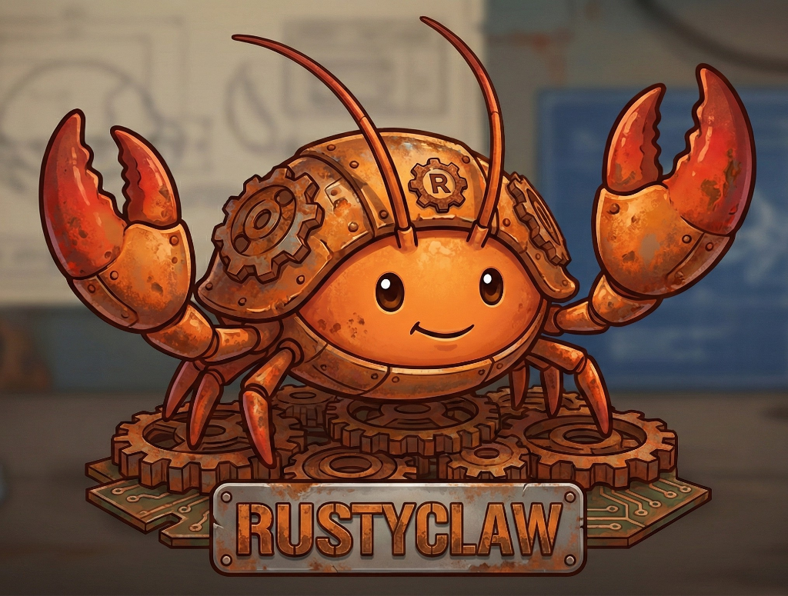
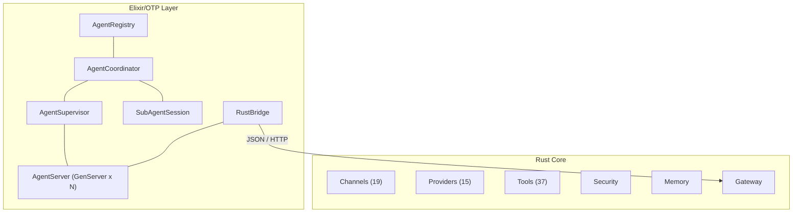

<p align="center">
  
</p>

<h1 align="center">RustyClaw</h1>

<p align="center">
  <strong>Multi-agent AI runtime — Rust core, Elixir/OTP orchestration</strong>
</p>

<p align="center">
  <a href="https://github.com/tezra-io/rustyclaw/actions/workflows/ci.yml"></a>
  <a href="LICENSE-APACHE"></a>
  
  <a href="https://github.com/tezra-io/rustyclaw/stargazers"></a>
</p>

---

## What is RustyClaw?

RustyClaw is an AI agent runtime that pairs a high-performance **Rust core** with an **Elixir/OTP orchestration layer** for multi-agent coordination. The Rust layer handles LLM providers, messaging channels, tool execution, security, and memory. The Elixir layer manages agent lifecycle, supervision, inter-agent messaging, and capability-based routing using OTP primitives.

Key capabilities:

- **19 messaging channels** — Telegram, Discord, Signal, Slack, WhatsApp, and more
- **15 LLM providers** — Anthropic, OpenAI, Gemini, Ollama, Bedrock, and more
- **37 built-in tools** — shell, file I/O, web, memory, browser, cron, hardware
- **Multi-agent orchestration** — OTP supervision trees, capability routing, delegation ACL
- **Multiple memory backends** — SQLite, Markdown, Qdrant, Postgres
- **Security by default** — sandboxing, policy engine, prompt guard, human-in-the-loop approval

## Architecture



<details>
<summary>ASCII fallback (for terminals)</summary>

```
┌─────────────────────────────────────────────────────┐
│                Elixir/OTP Layer                     │
│                                                     │
│  AgentRegistry ── AgentCoordinator                  │
│                       │                             │
│              AgentSupervisor ── SubAgentSession      │
│                   │                                 │
│           AgentServer (GenServer x N)               │
│                   │                                 │
│              RustBridge                             │
└───────────────────┬─────────────────────────────────┘
                    │ JSON / HTTP (localhost)
┌───────────────────▼─────────────────────────────────┐
│                  Rust Core                          │
│                                                     │
│  Channels (19)  Providers (15)  Tools (37)          │
│  Security       Memory          Gateway             │
└─────────────────────────────────────────────────────┘
```

</details>

The **Elixir layer** owns agent lifecycle (spawn/stop/restart), registry, inter-agent messaging via BEAM message passing, capability-based routing, delegation ACL, and session persistence (ETS). The **Rust layer** owns channels, tool execution, LLM provider integration, security/approval, memory, the HTTP gateway, cron scheduling, and hardware peripherals. The two layers communicate over a localhost HTTP bridge.

## Features

### Messaging Channels

Telegram, Discord, Signal, Slack, WhatsApp, Matrix, IRC, XMPP, Nostr, MQTT, Zulip, Google Chat, Rocket.Chat, Microsoft Teams, Twilio, Email (IMAP/SMTP), Webhook, SSE, WebSocket.

### LLM Providers

Anthropic, OpenAI, Google Gemini, Ollama, AWS Bedrock, Azure OpenAI, Groq, Mistral, Cohere, Together, OpenRouter, DeepSeek, Fireworks, Cerebras, xAI.

### Tools

Shell execution, file I/O, web fetch, memory read/write, browser automation, cron scheduling, hardware GPIO, sub-agent management, and more.

### Memory Backends

SQLite, Markdown files, Qdrant (vector), Postgres.

### Security

OS-level sandboxing, deny-by-default policy engine, prompt guard, secret management, human-in-the-loop approval system.

## Quick Start

### Prerequisites

- Rust 1.87+ (`rustup update stable`)
- At least one LLM provider API key

### Install from source

```bash
git clone https://github.com/tezra-io/rustyclaw.git
cd rustyclaw
cargo install --path .
```

### First run

```bash
# Initialize configuration
rustyclaw onboard

# Start the gateway
rustyclaw start
```

### Configuration

RustyClaw reads configuration from `~/.rustyclaw/config.toml`. Key settings:

```toml
[provider]
name = "anthropic"
api_key = "sk-..."
model = "claude-sonnet-4-5"

[channel.telegram]
token = "your-bot-token"

[memory]
backend = "sqlite"

[security]
require_pairing = true
```

See [docs/config-reference.md](docs/config-reference.md) for the full schema.

## Development

### Build and test

```bash
# Format, lint, test
cargo fmt --all -- --check
cargo clippy --all-targets -- -D warnings
cargo test
```

### Elixir orchestration layer

```bash
cd elixir/rustyclaw_orchestrator
mix deps.get
mix compile --warnings-as-errors
mix test
mix format --check-formatted
mix credo --strict
```

### Smoke test (E2E)

Requires at least one provider API key:

```bash
OPENROUTER_API_KEY=sk-... ./scripts/smoke-test.sh
```

Builds the release binary, boots the gateway on a random port, validates `/health`, and runs a chat round-trip.

## Project Status

| Component | Status |
|-----------|--------|
| Rust core (channels, providers, tools, security, memory, gateway) | Stable |
| Elixir orchestration (agent lifecycle, registry, coordination) | In progress |
| Rust-Elixir bridge (HTTP) | In progress |

## License

Licensed under either of:

- [Apache License, Version 2.0](LICENSE-APACHE)
- [MIT License](LICENSE-MIT)

at your option.

## Acknowledgments

Forked from [ZeroClaw](https://github.com/zeroclawlabs/zeroclaw). RustyClaw extends the original single-agent runtime with Elixir/OTP multi-agent orchestration.
