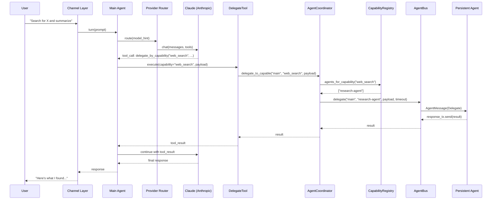
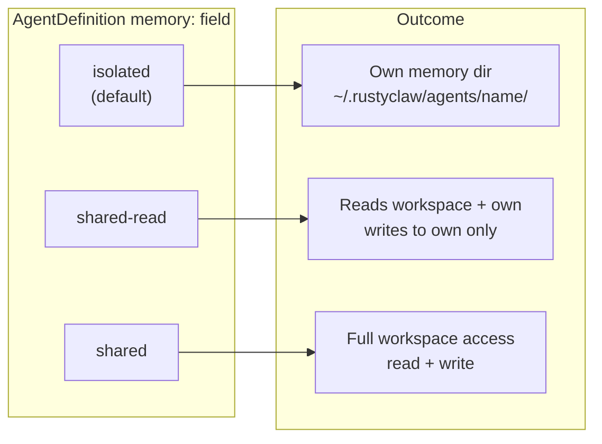
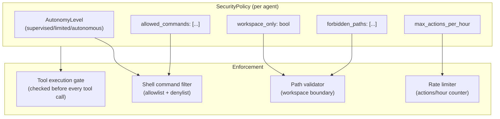

# RustyClaw Multi-Agent System Architecture

This document shows the full architecture of RustyClaw's multi-agent system, suitable for embedding in the README, investor decks, or technical documentation.

---

## System Overview

```mermaid
graph TB
    subgraph Users["👤 Users / Clients"]
        U1["Telegram"]
        U2["Discord"]
        U3["Signal"]
        U4["WhatsApp / iMessage"]
        U5["HTTP Gateway"]
        U6["CLI / REPL"]
    end

    subgraph Channels["📡 Channel Layer"]
        CL["Channel Supervisor\n(auto-reconnect)"]
        GW["HTTP Gateway\n(webhook + REST API)"]
    end

    subgraph Core["🧠 Main Agent Runtime"]
        MAL["Agent Loop\n(turn-based, async)"]
        SPB["System Prompt Builder\n(identity + skills + context)"]
        MML["Memory Loader\n(relevance-ranked recall)"]
        PR["Provider Router\n(model routing by hint)"]
    end

    subgraph AgentBus["🚌 Agent Bus (Inter-Agent Messaging)"]
        BUS["AgentBus\n(mpsc channels + ACL)"]
        COORD["AgentCoordinator\n(capability-based routing)"]
        CAPREG["CapabilityRegistry\n(agent → capabilities map)"]
    end

    subgraph PersistentAgents["🤖 Persistent Agents"]
        PA1["Agent A\n(e.g. twitter-agent)\ncap: [social_media]"]
        PA2["Agent B\n(e.g. research-agent)\ncap: [web_search, summarize]"]
        PA3["Agent N\n(user-defined)"]
    end

    subgraph Providers["☁️ AI Providers"]
        P1["Anthropic\n(Claude)"]
        P2["OpenRouter\n(multi-model)"]
        P3["OpenAI\n(GPT-4o)"]
        P4["Gemini / Local\n(Ollama, etc.)"]
    end

    subgraph Memory["💾 Memory Layer"]
        MM1["Main Memory\n(Markdown / SQLite)"]
        MM2["Agent Memory A\n(isolated)"]
        MM3["Agent Memory B\n(isolated)"]
        MMC["Composite Memory\n(shared-read agents)"]
    end

    subgraph Tools["🔧 Tool Registry"]
        T1["Shell / File Tools"]
        T2["Web Search / Fetch"]
        T3["DelegateTool\n(route to agent by name)"]
        T4["Memory Tools\n(store / recall)"]
        T5["Cron / Schedule"]
        T6["Skill Tools\n(user-installed)"]
    end

    subgraph Persistence["📁 Disk Persistence"]
        D1["~/.rustyclaw/config.toml"]
        D2["~/.rustyclaw/agents/*.md\n(agent definitions)"]
        D3["~/.rustyclaw/workspace/\n(main memory + skills)"]
        D4["~/.rustyclaw/agents/<name>/\n(agent data + session history)"]
    end

    subgraph Scheduler["⏰ Scheduler"]
        CRON["Cron Scheduler\n(agent-scheduled tasks)"]
    end

    %% User → Channels
    U1 & U2 & U3 & U4 --> CL
    U5 --> GW
    U6 --> MAL

    %% Channels → Core
    CL --> MAL
    GW --> MAL
    GW --> BUS

    %% Core → Providers
    MAL --> SPB --> MML
    MAL --> PR
    PR --> P1 & P2 & P3 & P4

    %% Core → Tools
    MAL --> Tools

    %% DelegateTool → Bus
    T3 --> BUS

    %% Bus ↔ Coordinator ↔ Registry
    COORD --> CAPREG
    COORD --> BUS
    BUS <--> PA1
    BUS <--> PA2
    BUS <--> PA3

    %% Persistent Agents → Providers
    PA1 --> P2
    PA2 --> P1
    PA3 --> P2

    %% Memory connections
    MAL --> MM1
    PA1 --> MM2
    PA2 --> MM3
    MMC --> MM1
    MMC --> MM3

    %% Persistence
    D2 --> PA1 & PA2 & PA3
    D1 --> MAL
    D3 --> MM1
    D4 --> MM2 & MM3

    %% Scheduler → Bus
    CRON --> BUS

    style Users fill:#e8f4f8,stroke:#2196F3
    style Channels fill:#fff3e0,stroke:#FF9800
    style Core fill:#f3e5f5,stroke:#9C27B0
    style AgentBus fill:#e8f5e9,stroke:#4CAF50
    style PersistentAgents fill:#fce4ec,stroke:#E91E63
    style Providers fill:#fff8e1,stroke:#FFC107
    style Memory fill:#e0f2f1,stroke:#009688
    style Tools fill:#f1f8e9,stroke:#8BC34A
    style Persistence fill:#fafafa,stroke:#9E9E9E
    style Scheduler fill:#ede7f6,stroke:#673AB7
```



---

## Delegation Flow



---

## Memory Isolation Model



---

## Security Boundary



---

## Agent Definition Schema

An agent is defined as a markdown file with YAML frontmatter:

```yaml
# ~/.rustyclaw/agents/research-agent.md
---
name: research-agent
persistent: true
skills:
  - web-research
capabilities:
  - web_search
  - summarization
memory: isolated
memory_backend: sqlite
delegates_to:
  - main-agent
model: anthropic/claude-3-5-sonnet
max_tools_per_turn: 10
allowed_tools:
  - web_search
  - memory_store
  - memory_recall
---

You are a research specialist. When delegated a task, search the web
thoroughly and provide a concise, well-cited summary.
```

---

*Diagram source: `docs/diagrams/multi-agent-architecture.md`  
Generated: 2026-02-26 | Version: post-TEZ-70-74*
